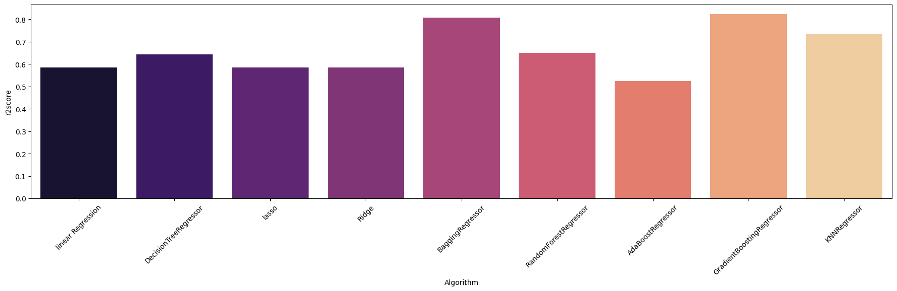

# Проект 1. Анализ работы алгоритмов ML

### Описание проекта 
На основании датасета о характеристиках ноутбуков и их стоимости я построил несколько моделей для сравнения их работы по различным метрикам. 

### Стек:

- pandas
- numpy
- matplotlib
- seaborn
- sklearn

***Этапы работы***

- Предобработка данных включающая в себя:

1) Переименовывание фичей
2) Замену полей со значением Nan
3) Использование модуля Encoding для присвоения текстовым данным дискретных значений
4) Поиск лучших фичей
5) Сплит данных
6) Нормализация данных

- Подбор метрик для оценки качества моделей

- Обучение 9 моделей для дальнейшего их сравнения

### Результаты работы 

Лучше всех на тестовых данных себя показала модель градиентного бустинга, что и следовало ожидать, поскольку она является наиболее эффективным методом машинного обучения для подобного рода задач.

